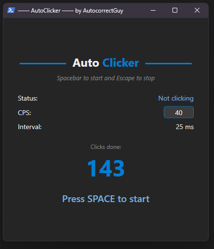

# 🖱️ AutoClickerApp

Simple auto clicker built with **C# + WPF**.  
Runs in-memory or compiles into a standalone `.exe`.  
No installers. No 3rd party dependencies. Lightweight and minimal.



---

## 🚀 Run in Development Mode (in-memory)

```ps1
start dev
```

```ps1
powershell -ep Bypass -File ./index.ps1
```

---

## 📦 Run in Build Mode (generate .exe)

```
powershell -ep Bypass -c { & "./index.ps1" -buildExe $true }
```

.. and then you can simply run the exe file.

---

## Configuration

You can configure hotkeys (start and stop) in "./AutoClickerApp/Config/GlobalHotkeyConfig.cs" by changing `Key.Space` and/or `Key.Escape` to other ther `System.Windows.Input.Key`: https://learn.microsoft.com/en-us/dotnet/api/system.windows.input.key *(from official Microsoft.com documentation)*.

## 🧠 How It Works

- All `.cs` files are combined into one single file
- Code is compiled using PowerShell’s `Add-Type`
- You choose whether to run it in-memory or generate an `.exe`
- No external libraries or tools required — just .NET Framework + PowerShell

---

## 📁 Project Structure

- `/AutoClickerApp/` – source code files
- `/index.ps1` – compiler + launcher
- `/AutoClickerApp.dll` – generated in-memory assembly
- `/AutoClickerApp.exe` – optional compiled executable
- `/AutoClickerAppFullCode.cs` – generated flattened code (for debugging)

---

## 💡 Features

- Zero-install, portable build system *(both for running in-memory script or by generating .exe file)*
- Global hotkey support *(Space to start, Escape to stop)*
- Adjustable click speed *(CPS input)*

> AutoClickerApp.dll and AutoClickerAppFullCode.cs will be generated after your run the `./index.ps1`. I left these files in the repository for you to view them if you are intereseted. 

> Another note: just running ./AutoClickerAppFullCode.cs won’t work on its own, because the XAML needs to resolve the correct namespace and reference the compiled DLL. At least in my case, running everything in a single step didn't work—so the solution is to first compile the app without executing it, and then run it by wrapping the entry point inside Program.Main() to ensure everything loads correctly. 