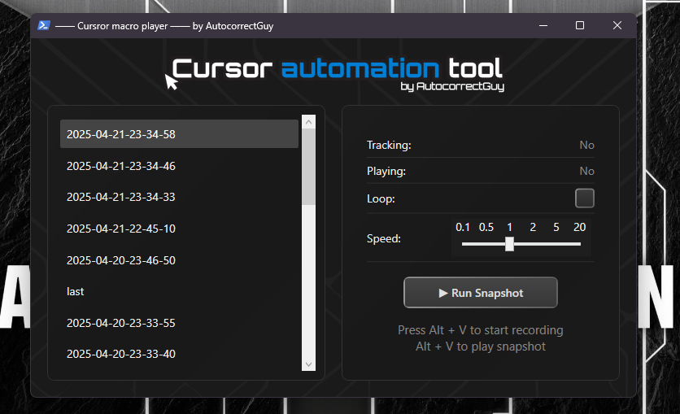

# 🖥️ SnapshotPlayer

Lightweight snapshot **recorder + player** built with **C# + WPF**.  
Records keyboard / mouse "snapshots", then re‑plays them on demand at any chosen speed.  
Runs entirely in‑memory *or* compiles to a standalone `.exe`—no installers, no external dependencies.

---

Why I even built this:
1. The whole thing could be compiled with csc.exe, right away, no downloades required - but antivirus checks it and
(not in this app), but in other apps, antivirus gets triggered because of P/Invoke stuff. 
2. Educational purposes. This has been lots of pain in the a** and it has been a journey in learning an applying different concepts
of not only coding, but programming itself. This whole thing is more or leess practice of:
- MVV pattern practice (Models, views, viewmodels);
- trying to separate logic from ui as much as possible;
- understanding what I can and can NOT do on Windows with P/Invoke
- core c# library/assembly usage, such as System.IO stuff
- oop
- and more.

---

> This was not meant to be design practice, so I fully asked chatgpt for the wpf xaml design and then just modified it by hand. Recently read a book about wpf design practices and it helped a lot there
---

## 🚀 Run in Development Mode (in‑memory)

    start dev

    powershell -ep Bypass -File ./index.ps1

---

## 📦 Run in Build Mode (generate .exe)

    powershell -ep Bypass -c { & "./index.ps1" -buildExe $true }

…then simply double‑click the generated **SnapshotPlayer.exe**.

---

## ⚙️ Configuration

All hotkeys live in **./SnapshotPlayer/Config/GlobalHotkeyConfig.cs**.

| Action                         | Default Key(s) | Change to any System.Windows.Input.Key |
|--------------------------------|----------------|----------------------------------------|
| Start / stop **recording**     | **Space**      | Replace Key.Space with any key |
| Start **playback**             | **Ctrl + R**   | Replace Key.R (and the modifier) |
| Stop **recording / playback**  | **Escape**     | Replace Key.Escape with any key |

---

## 🧠 How It Works

1. Every .cs file is flattened into one file.  
2. PowerShell's Add‑Type compiles that file:  
   * Run directly for an in‑memory assembly  
   * Add the **‑buildExe** flag for a portable SnapshotPlayer.exe  
3. No NuGet packages, no MSBuild—just .NET Framework + PowerShell.

---

## 📁 Project Structure

| Path                         | Purpose                          |
|------------------------------|----------------------------------|
| /SnapshotPlayer/             | Source code + XAML               |
| /index.ps1                   | Compiler / launcher script       |
| /SnapshotPlayer.dll          | Generated in‑memory assembly (1) |
| /SnapshotPlayer.app.exe      | Optional compiled executable     |
| /SnapshotPlayerFullCode.cs   | Single‑file flattened code       |

>The last three files appear automatically after the first run, if you are setting `$buildExe` as true in `index.ps1`, if not - the exe file is not generated and in-memory assembly is ran.)
There are actually 2 in-memory assemblys running then - one for loading the namespace and dll for xaml/xamlReader - second one - that wraps the whole thing together and has entrypoint `[Program]::Main()`

---

## 💡 Features

* **Zero‑install, portable build** – run from PowerShell as in-memory assembly or use the generate and run executable
* **Global hotkeys** – Space (record), Ctrl + R (play), Escape (stop)  
* **Live status panel** – shows **Tracking**, **Playing**, **Loop** state  
* **Loop mode** – toggle to repeat snapshots automatically  
* **Variable playback speed** – 0.1× to 20×  

> Tip: adjust the speed slider while a snapshot is running to slow down or fast‑forward playback in real time.

Enjoy hacking automation with **SnapshotPlayer**!
